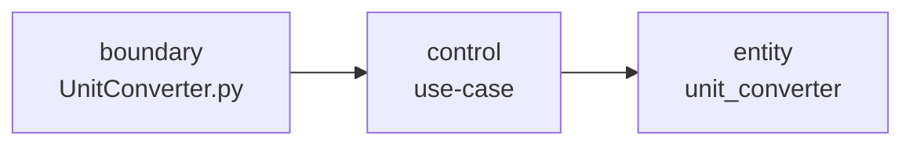

# Architecture — UnitConverter_08

| 항목 | 내용 |
|------|------|
| 문서 버전 | 1.0 |
| 작성일 | 2026-06-11 |
| 패턴 | ECB (Entity · Control · Boundary) |

---

## 1. 개요

UnitConverter_08는 **길이 단위 변환 CLI**이다. M1에서는 meter/feet/yard 변환과 pytest TDD를 우선하고, README의 OCP·설정 외부화·동적 등록은 M2로 분리한다.

## 2. 레이어

| 레이어 | 경로 | 책임 |
|--------|------|------|
| **Entity** | `src/entity/` | `parse_input`, `to_meters`, `convert_all`, `format_output`, `constants` |
| **Control** | `src/control/` | 입력→변환→출력 흐름 조율 (M1 CLI 연동 시) |
| **Boundary** | `src/boundary/`, `UnitConverter.py` | stdin/stdout, 사용자 프롬프트 |

### 의존 규칙

- entity는 boundary/control을 import하지 않는다.
- boundary는 변환 알고리즘을 소유하지 않는다 (baseline `UnitConverter.py`는 gap — REFACTOR 대상).
- 오류 계약: entity는 `ValueError`; boundary는 CLI 메시지로 변환.

## 3. 모듈 맵 (M1)

| 모듈 | 상태 | 설명 |
|------|------|------|
| `entity/constants.py` | ✅ | `METER_TO_FEET`, `METER_TO_YARD` |
| `entity/unit_converter.py` | 🔶 stub | 4개 API — GREEN 대상 |
| `src/unit_converter.py` | ✅ shim | `from entity.unit_converter import …` |
| `control/` | ⬜ placeholder | CLI 연동 전 |
| `boundary/` | ⬜ placeholder | CLI 연동 전 |
| `UnitConverter.py` | ✅ baseline | 36줄 절차형 (entity 미연동) |

## 4. 테스트 구조

| Track | Layer | 경로 |
|-------|-------|------|
| Logic | entity | `tests/entity/test_unit_converter.py` |
| UI | boundary | `tests/boundary/` (M1 후반) |

`pyproject.toml`: `pythonpath = ["src"]` — `from unit_converter import …` 호환.

## 5. 데이터 흐름 (목표)

1. boundary: `input()` → raw string
2. control: `parse_input` → `convert_all` → `format_output`
3. boundary: `print` 각 출력 줄

현재 baseline은 1~3을 `UnitConverter.main` 한 함수에 혼합 (ECB 위반 — `/refactor-smell` P0 후보).

## 6. 참고

- 요구사항: `docs/PRD.md`
- TDD·Phase: `.cursor/rules/10-tdd-rules.mdc`
- Sub-Agent: `AGENTS.md`
